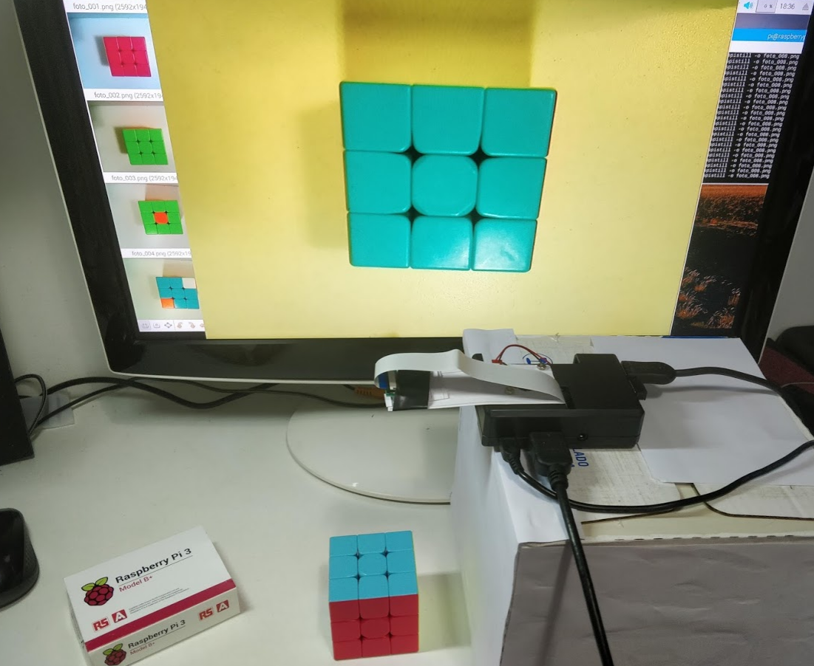

# Projeto - Controle de qualidade de uma fábrica de Cubo Mágico

---

Este projeto consiste em uma experiência para aprender a desenvolver um algoritmo de Image Classification e Object Tracking diretamente do Google Colab.

A ideia original é de simular uma linha de produção, onde procura-se resolver um problema de identificar e separar os produtos defeituosos dos produtos sem defeitos. Uma grande premissa desta tarefa é que todo o projeto deve ser feito no Google Drive/Google Colab, uma vez que o equipamento disponível para se fazer o trabalho é um Chromebook, computador que roda o sistema operacional Chrome OS, sendo capaz de utilizar somente o navegador de internet e algumas poucas aplicações em Linux.

Para simular o produto, foi utilizado um cubo mágico, objeto este escolhido por possuir a capacidade de "criar" diferentes padrões com um mesmo objeto. Assim, para a criação do dataset, foi possível utilizar centenas de imagens diferentes com um único cubo mágico (em seu estado resolvido e embaralhado).

## Escolha do Dataset

Para o projeto, foi considerado que o cubo em seu estado resolvido era um produto OK -sem defeitos-, enquanto que o cubo embaralhado é considerado um "produto defeituoso".

  

  

Para o treinamento do modelo, foram utilizadas **392** fotos do Produto OK e **556** fotos do Produto Defeituoso.

Link para a pasta do Google Drive com todas as fotos utilizadas para o treinamento do modelo: https://drive.google.com/drive/folders/1EAu9tSpqVLM12sh8zALg3iYnnvDihDfl?usp=sharing

## Data Labeling
Como a Sabina Pokhrel diz em seu excelente artigo no [Medium](https://towardsdatascience.com/image-data-labelling-and-annotation-everything-you-need-to-know-86ede6c684b1), Data Labelling é uma etapa essencial em uma tarefa de Machine Learning supervisionado. *"Se você mostrar um tomate a uma criança e disser que é uma batata, da próxima vez que a criança vir um tomate, é muito provável que ele a classifique como batata. Na medida que um modelo de machine learning aprende de maneira semelhante, olhando para exemplos, o resultado do modelo depende dos labels que alimentamos durante sua fase de treinamento."*

Já vou arregaçando as mangas que aqui é a parte mais braçal do projeto! Foi necessário classificar, manualmente, cada uma das fotos do produto criando uma "caixa" ao redor de cada cubo mágico e criando a label correspondente à imagem (se era Produto_OK ou se era Produto_defeituoso). Assim, o modelo saberá localizar onde está o cubo mágico e terá uma ideia se o cubo está embaralhado ou não. Para criar as labels, foi utilizado o [LabelIMG](https://github.com/tzutalin/labelImg).

  

Link da pasta no Google Drive com todas as annotations: https://drive.google.com/drive/folders/1hifliCN7_JzPLXMnMMy9nMODOHr4AQr8?usp=sharing

## Treinando o Modelo
Link do algoritmo no Google Colab: https://colab.research.google.com/drive/1zetvD21biDup6xlk_uS2A_MufVLfGVT_ (**Obs:** Aqui pretendo relatar todas as etapas do projeto como um todo. Futuramente pretendo escrever um artigo no Medium falando unicamente sobre o funcionamento deste código). 

Antes de iniciar o código, foi preciso gravar um vídeo que serve de input para que o algoritmo localize o cubo mágico e então possa rastreá-lo e classificar se ele está resolvido ou não. Após gravar o vídeo e colocá-lo no caminho correto do Google Drive, finalmente foi possível rodar o código e, após o algoritmo treinar e fazer a análise sobre o vídeo que coloquei de input, o mesmo gerou um arquivo de vídeo com o output.

### O resultado final pode ser visto nesta minha [postagem no LinkedIn](https://www.linkedin.com/posts/lucasmirachi_deeplearning-objectdetection-imageclassification-activity-6592496956382171136-h268).

## Conclusão
De modo geral, os resultados obtidos neste projeto foram muito satisfatórios. Tendo em vista o intuito do projeto, foi possível se obter uma boa experiência em todo um projeto de Data Science, indo desde a definição do problema, passando pela coleta dos dados e resultando em muita pesquisa e no desenvolvimento do algoritmo e o mais interessante, tudo diretamente no Google Drive. 

Para os olhares mais atentos, pode-se perceber que a accuracy (o número do lado dos dizeres "Produto OK" ou "Produto_Defeituoso", no canto superior esquerdo da caixa que o algoritmo desenhou ao redor do cubo mágico) não foi dos melhores. Muitas vezes o modelo identificava o produto como defeituoso quando ele estava OK, e vice-versa. Possivelmente foi devido à presença do meu dedo para movimentar o cubo na câmera que confundiu o algoritmo, uma vez que, nas fotos utilizadas para o treinamento, só tínhamos fotos de produtos no fundo branco. 

### Próximos passos
Como próximos passos, pretendo fazer uma melhoria no algoritmo, para que o mesmo passe a operar em tempo real, para dispensar o trabalho de ser necessário gravar um vídeo, fazer upload no Google Drive para só então ter um vídeo do resultado como output.
Outra mudança é que, no próximo projeto, pretendo utilizar um RaspberryPi3 com uma câmera, para assim gravar a "linha de produção" em tempo real. Já iniciei os testes, porém ainda há muito trabalho a ser feito e muito o que aprender! Segue uma foto *spoiler* do  Projeto Cubo Mágico 2.0 =):

  

